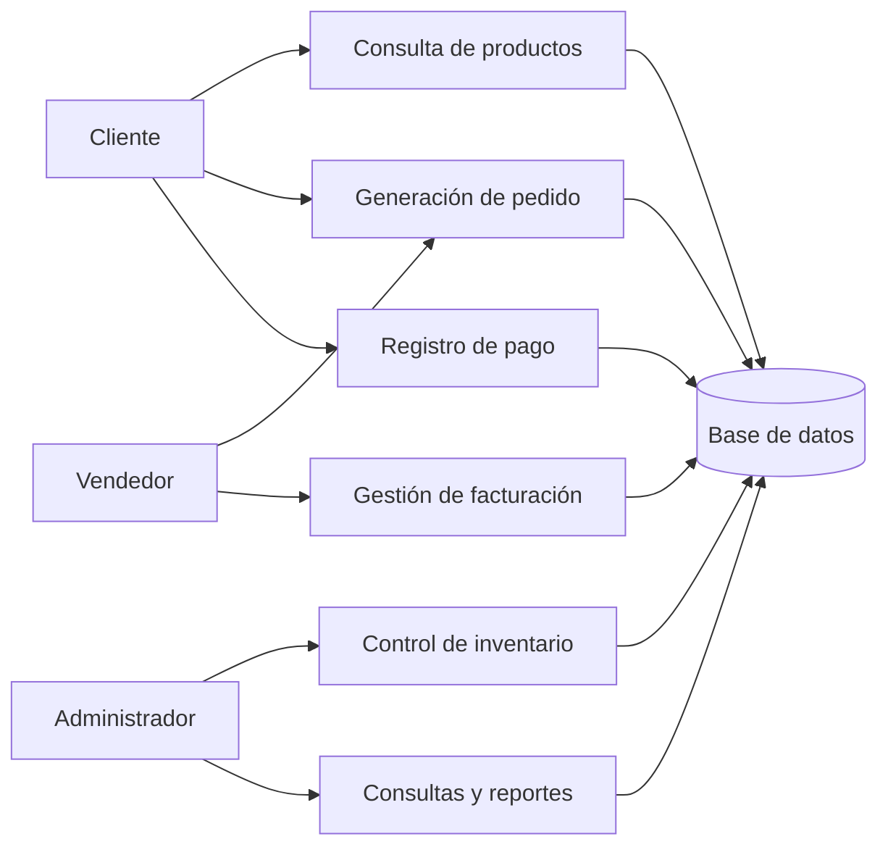
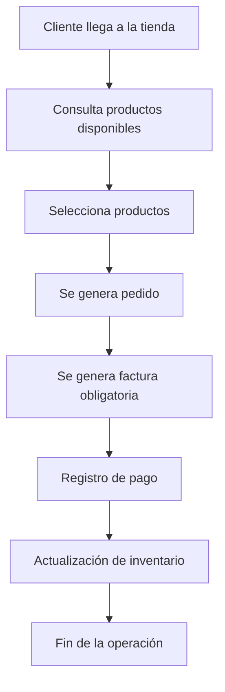
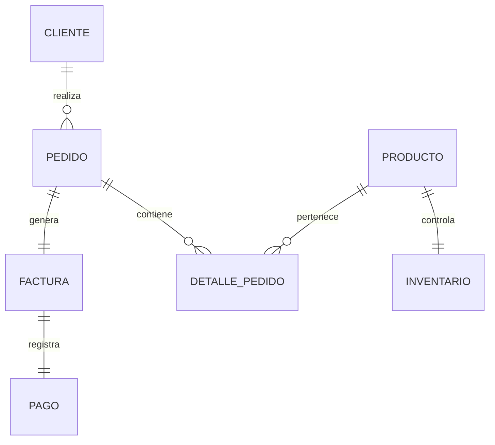

# Diagramas Iniciales — Tienda de Repuestos para Motos

Estos diagramas representan una aproximación inicial al dominio de la tienda física de venta de repuestos para motos.  
Su propósito es facilitar el análisis del sistema antes de construir el modelo conceptual definitivo.

No representan el modelo final obligatorio.

---

## 1. Diagrama de contexto

---

## 2. Flujo principal del sistema

---

## 3. Modelo conceptual inicial

